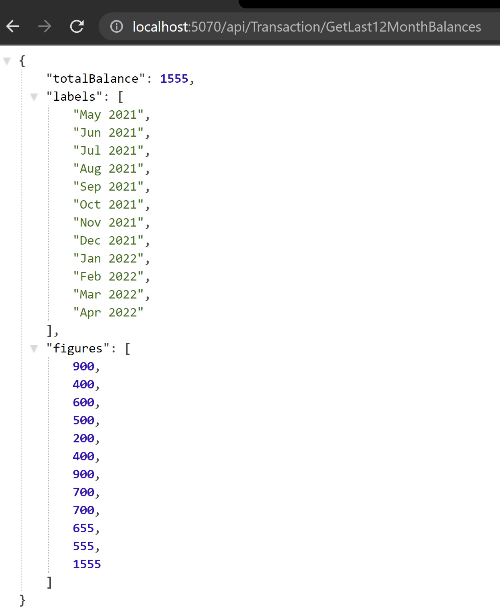

# Service Oriented Architecture

## Monolithic vs Microservices

A monolithic application is simply deployed on a set of identical servers behind a load balancer. In contrast, a microservice application typically consists of a large number of services. Each service will have multiple runtime instances. And each instance need to be configured, deployed, scaled, and monitored.

## About this exercise

In this exercise we will

- Create a new ASP.NET Core Web API
- Create class library projects (Entities, Infrastructure, and Services)
- Create Entity Model for Account and Transaction
- Initialize the data using **List**
- Create and inject the Transaction Service
- Finally, consume the data using API endpoint in Web API project

## Design Patterns

There are different design pattens to architect monolithic APIs few of famous patterns are;

- Service Oriented Architecture (SOA)
- Command Query Responsibility Segregation (CQRS)
- Domain Driven Design (DDD)

In this project we are going to use Service Oriented Architecture (SOA)

## Step 1: Create Repository for API Code

To create the repository. See ...

## Step 2: Initiating .NET Project

Create Empty ASP.NET Core API Project using .NET 6


## Step 3: Project Structuring

There are going to be essentially four (4) types of projects in our application

- API Project: Controllers & Middlewares (already created through scaffolding)
- Entities: This project contains DB models like User where each User has one Account and each Account can have one or many Transactions. There is also a Response Model of LineGraphData that will be returned as API Response.
- Infrastructure: This project contains BBBankContext that servs as fake DBContext that populates one User with its corresponding Account that has three Transactions dated of last three months with hardcoded data.
- Services: This project contains TranasacionService with the logic of converting Transactions into LineGraphData after fetching them from BBBankContext.
- BBBankAPI: This project contains TransactionController with 2 GET methods GetLast12MonthBalances & GetLast12MonthBalances/{userId} to call the TransactionService.


Create .Net class librayr projects for Entities, Infrasturture, and Services
Delete Class1.cs files created by default.

## Step 4: Entities Project

Then we will create folder for requests and Response models.


## Step 5: Creating Base Model

In Entities Project we will create our first model **BaseEntity** which will have an **Id** property . All other database entities will derive from this class.

```csharp
public class BaseEntity
{
        [Key] // Unique Key for entity in database
        public string Id { get; set; }
}
```

## Step 6: User Model

```csharp
public class User : BaseEntity // Inheriting from Base Entity class
{
        // First name
        public string FirstName { get; set; }
        
        // Last name
        public string LastName { get; set; }
        
        // Email of the user
        public string Email { get; set; }
        
        // Profile picture or avatar
        public string ProfilePicUrl { get; set; }
        
        // Account attached to the user 
        public Account Account { get; set; }
}
```

## Step 7: Account Model

Next create a model to store accounts information

```csharp
public class Account : BaseEntity // Inheriting from Base Entity class
{
        // String that uniquely identifies the account
        public string AccountNumber { get; set; }

        //Title of teh account
        public string AccountTitle { get; set; }

        //Available Balance of the account
        public decimal CurrentBalance { get; set; }

        //Account's status
        public AccountStatus AccountStatus { get; set; }

        // One Account might have 0 or more Transactions (1:Many relationship)
        public ICollection<Transaction> Transactions { get; set; }
}

// Two posible statuses of an account
public enum AccountStatus
{
        Active = 0,     // When an account can perform transactions
        InActive = 1    // When an account cannot perform transaction
}
```

## Step 8: Transaction Model

Next create a model to store Transactions related to an Account

```csharp
public class Transaction : BaseEntity // Inheriting from Base Entity class
{
        //Transaction type
        public TransactionType TransactionType { get; set; }

        //When transaction was recorded
        public DateTime TransactionDate { get; set; }

        //Amount of transaction
        public decimal TransactionAmount { get; set; }

        //Associcated acocunt of that transaction
        public Account Account { get; set; }
}

// Two posible types of an Trasaction
public enum TransactionType
{
        Deposit = 0,    // When money is added to account
        Withdraw = 1    // When money is subtracted from account
}
```

After these steps the over all project sturcture should look like as follows


## Step 9: Adding Database Context (BBBankContext)

Accessing real database and creating seed data is beyond scope of this exersise. So we will create a custom database conetxt (DbContext) with some hard coded data.

Create a new C# class **BBBankContext**

## Step 10: Hard coding some data

In the constructor of BBBankContext we will initialize Accounts and will add some transactions to this account so we can return some data.

```csharp
public class BBBankContext
{
        public BBBankContext()
        {
            // creating the collection for user list
            this.Users = new List<User>();
            
            // initializing a new user 
            this.Users.Add(new User
            {
                Id = "aa45e3c9-261d-41fe-a1b0-5b4dcf79cfd3",
                FirstName = "Raas",
                LastName = "Masood",
                Email = "rassmasood@hotmail.com",
                ProfilePicUrl = "https://res.cloudinary.com/demo/image/upload/w_400,h_400,c_crop,g_face,r_max/w_200/lady.jpg"
            });
            
            // creating the collection for account list
            this.Accounts = new List<Account>();
            
            // initializing a new account 
            this.Accounts.Add(new Account
            {
                Id = "37846734-172e-4149-8cec-6f43d1eb3f60",
                AccountNumber = "0001-1001",
                AccountTitle = "Raas Masood",
                CurrentBalance = 3500M,
                AccountStatus = AccountStatus.Active,
                User = this.Users[0]
            });
            
            // creating the collection for transaction list
            this.Transactions = new List<Transaction>();
            
            // initializing with some transactions 
            this.Transactions.Add(new Transaction()
            {
                Id = Guid.NewGuid().ToString(),
                TransactionAmount = 1000M,
                TransactionDate = DateTime.Now,
                TransactionType = TransactionType.Deposit,
                Account = this.Accounts[0]
            });
            this.Transactions.Add(new Transaction()
            {
                Id = Guid.NewGuid().ToString(),
                TransactionAmount = -100M,
                TransactionDate = DateTime.Now.AddMonths(-1),
                TransactionType = TransactionType.Withdraw,
                Account = this.Accounts[0]
            });
            this.Transactions.Add(new Transaction()
            {
                Id = Guid.NewGuid().ToString(),
                TransactionAmount = -45M,
                TransactionDate = DateTime.Now.AddMonths(-2),
                TransactionType = TransactionType.Withdraw,
                Account = this.Accounts[0]
            });
            //More Transactions ....
        }
        
        public List<Transaction> Transactions { get; set; }
        public List<Account> Accounts { get; set; }
        public List<User> Users { get; set; }
}

```

## Step 11: Creating Interface for Transaction Service

In **Services** project we create an interface (contract) to implement the seperation of concerns.
It will make our code testable and injectable as a dependency.

```csharp
public interface ITransactionService
{
        Task<LineGraphData> GetLast12MonthBalances(string? userId);
}
```

## Step 12: Creating Transaction Service Implementation

In **Services** project we will create an implementation for our transaction service.

In this class we will be implementing **ITransactionService** interface.

```csharp
public async Task<LineGraphData> GetLast12MonthBalances(string? userId)
{
        // Object to contain the line graph data
        var lineGraphData = new LineGraphData();

        // Object to contain the transactions data
        var allTransactions = new List<Transaction>();
        if (userId == null)
        {
                // if account id is NULL then fetch all transactions
                allTransactions = _bbBankContext.Transactions.ToList();
        }
        else
        {
                // if account id is not NULL then fetch all transactions for specific account id
                allTransactions = _bbBankContext.Transactions.Where(x => x.Account.User.Id == userId).ToList();
        }
        if (allTransactions.Count() > 0)
        {
                // Calculate the total balance till now
                var totalBalance = allTransactions.Sum(x => x.TransactionAmount);
                lineGraphData.TotalBalance = totalBalance;
                
                decimal lastMonthTotal = 0;
                
                // looping through last three months starting from the current
                for (int i = 12; i > 0; i--)
                {
                    // Calculate the running total balance
                    var runningTotal = allTransactions.Where(x => x.TransactionDate >= DateTime.Now.AddMonths(-i) &&
                       x.TransactionDate < DateTime.Now.AddMonths(-i + 1)).Sum(y => y.TransactionAmount) + lastMonthTotal;
                       
                    // adding labels to line graph data for current month and year
                    lineGraphData.Labels.Add(DateTime.Now.AddMonths(-i + 1).ToString("MMM yyyy"));
                    
                    // adding data to line graph data for current month and year
                    lineGraphData.Figures.Add(runningTotal);
                    
                    // saving the running total for this month
                    lastMonthTotal = runningTotal;
                }
        }
        // returning the line graph data object
        return lineGraphData;
}
```

## Step 13: Creating Transaction API

In Program.cs file we will add **BBBankContext** and **ITransactionService** to services container.

```csharp
builder.Services.AddScoped<ITransactionService, TransactionService>();
builder.Services.AddSingleton<BBBankContext>();
```

## Step 14: Creating Transaction API

Create a new API Controller named **TransactionController** and inject the **ITransactionService** using the constructor.

```csharp
private readonly ITransactionService _transactionService;
public TransactionController(ITransactionService transactionService)
{
    _transactionService = transactionService;
}
```

Now we will create a method **GetLast12MonthBalances** to get last 12 months data.

```csharp
[HttpGet]
[Route("GetLast12MonthBalances")]
public async Task<ActionResult> GetLast12MonthBalances()
{
    try
    {
        return new OkObjectResult(await _transactionService.GetLast12MonthBalances(null));
    }
    catch (Exception ex)
    {
        return new BadRequestObjectResult(ex);
    }
}
```

Now we will create a method **GetLast12MonthBalances** for a specific account to get last 12 months data.

```csharp
[HttpGet]
[Route("GetLast12MonthBalances/{userId}")]
public async Task<ActionResult> GetLast12MonthBalances(string userId)
{
    try
    {
        return new OkObjectResult(await _transactionService.GetLast12MonthBalances(userId));
    }
    catch (Exception ex)
    {
        return new BadRequestObjectResult(ex);
    }
}
```

The result looks like this


